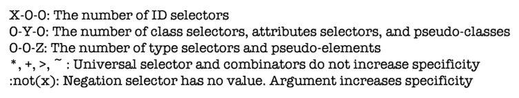
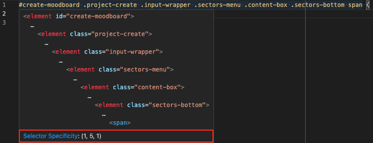

# CSS specificity

1. [What is CSS specificity?](#1-what-is-css-specificity)
2. [Selector specificity weights](#2-selector-specificity-weights)
3. [Calculating specificity](#3-calculating-specificity)
4. [The importance of understanding CSS specificity](#4-the-importance-of-understanding-css-specificity)
5. [Hacking specificity](#5-hacking-specificity)
6. [Conclusions](#6-conclusions)
7. [Recommended reads](#7-recommended-reads)

---

## 1. What is CSS specificity?

According to [MDN Web Docs](https://developer.mozilla.org/en-US/docs/Web/CSS/Specificity):

> Specificity is a weight that is applied to a given CSS declaration, determined by the number of each selector type in the matching selector. When multiple declarations have equal specificity, the last declaration found in the CSS is applied to the element. Specificity only applies when the same element is targeted by multiple declarations.

👨🏻‍💻 [Example 01 (CodePen)](https://codepen.io/nadalsol/pen/VwmyPMQ)

If cascade, or source order, were the only concern, the paragraph would be yellow. However, **different selectors have different weights**. An ID takes precendence over a class selector takes precendence over a type selector. **So, the paragraph would be red.**

## 2. Selector specificity weights

1. `!important`
2. `style=””`
3. id
4. class/pseudo-class/attributes
5. type

## 3. Calculating specificity



[Visual Studio Code](https://code.visualstudio.com/) comes with selector specificity hints (just over your CSS declarations).



## 4. The importance of understanding CSS specificity

### Example 2

In real world projects, is quite common to see ugly/over-specific selectors like these:

👨🏻‍💻 [Example 02 (CodePen)](https://codepen.io/nadalsol/pen/MWbrJxj)

Following this example, if I need to add a new color declaration I have to be even more specific, or even worse, using `!important`.

> This causes CSS code to be hard to mantain, difficult to read and to debug, leading to errors and incosistencies. This is how the **specificity wars begins** and trust me, it never ends!
>
> – Me

### Example 3a (wrong)

- Increases specificity
- Introduces **location dependency** (these styles will only work when the `.avatar` component is in the `.header` component)
- Not good!

👨🏻‍💻 [Example 03a (CodePen)](https://codepen.io/nadalsol/pen/WNodpzR)

### Example 3b (better)

- Keeps specificity low
- No **location dependency** (`.avatar` will look as expected everywhere)
- Perfect!

👨🏻‍💻 [Example 03b (CodePen)](https://codepen.io/nadalsol/pen/XWNVMOP)

## 5. Hacking specificity

No matter how hard we try, and how conscientious we are, there will always be times that we need to hack and wrangle specificity.

It's important that we handle the hacks as safely and elegantly as possible.

### Wrong

We could nest the class inside something else to bring its specificity up.

<!-- prettier-ignore -->
```scss
.header .site-nav {}
```

It introduces **location dependency**: these styles will only work when the `.site-nav` component is in the `.header` component.

### Better

We can chain that class with itself:

<!-- prettier-ignore -->
```scss
.site-nav.site-nav {
}
```

This chaining doubles the specificity of the selector, but does not introduce any dependency on location.

## 6. Conclusions

The key here isn’t so much eliminating specificity completely, but **managing it better**:

- Don’t nest selectors unless absolutely necessary.
- Never use **IDs**.
- Use **type** selectors for general stuff (`blockquote {}`, `a {}`, `table {}`, etc…).
- Use **class** selectors for UI elements, in conjunction with a namespacing methodology like [BEM](https://csswizardry.com/2013/01/mindbemding-getting-your-head-round-bem-syntax/).
- Don't use **qualifying classes** (like `ul.nav {}`).
- Flatten your CSS as much as possible (the less use of the cascade, the less specificity conflicts and less work for the browser).
- Write your CSS in specificity order (getting progressively more specific).
- A scalable and maintainable CSS architecture, like [ITCSS](https://speakerdeck.com/dafed/managing-css-projects-with-itcss), can be very handy!

> Specificity can be wrangled and understood, but it is safer just to avoid it entirely.
>
> – Harry Roberts

## 7. Recommended reads

- [CSS Specificity with plankton, fish and sharks](http://www.standardista.com/css3/css-specificity/)
- [Specificity Calculator](https://specificity.keegan.st/)
- [The Specificity Graph](https://csswizardry.com/2014/10/the-specificity-graph/)
- [cssguidelin.es > Specificity](https://cssguidelin.es/#specificity)
