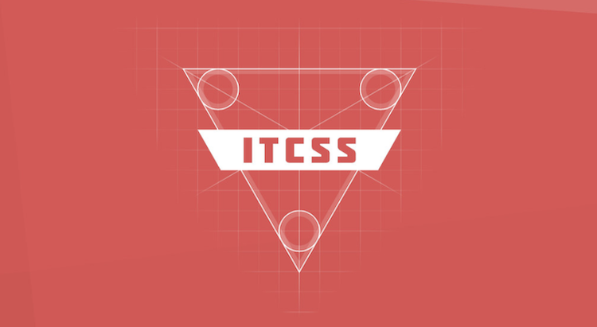
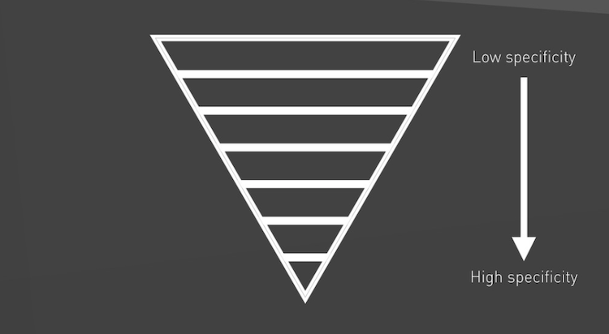
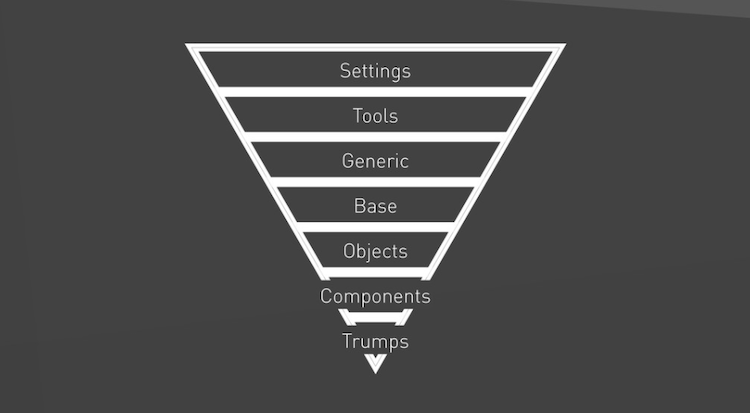

# ITCSS

1. [What is ITCSS?](#1-what-is-itcss)
2. [The CSS problem](#2-the-css-problem)
3. [Managing CSS projects with ITCSS](#3-managing-css-projects-with-itcss)
4. [Recap](#4-recap)
5. [Recommended reads](#5-recommended-reads)

---

## 1. What is ITCSS?

**ITCSS** is a simple effective **methodology** to help **manage, maintain, and scale CSS projects** of all sizes. ITCSS stands for **Inverted Triangle** architecture for **CSS**.

## 2. The CSS problem

> It doesn't matter how well-considered your **source order** is; how well you're **utilising the cascade**; what **naming conventions** you use; **specificity can undo everything**.
>
> – Harry Roberts

## 3. Managing CSS projects with ITCSS

In short: **write CSS in specificity order**.

### Default layers

1. **Settings:** Global variables, config switches.
2. **Tools:** Default mixins and functions.
3. **Generic:** Ground-zero styles (Normalize.css, resets, box-sizing).
4. **Base:** Unclassed HTML elements (type selectors).
5. **Objects:** Cosmetic-free design patterns.
6. **Components:** Designed components, chunks of UI.
7. **Trumps:** Helpers and overrides.

👨🏻‍💻 [ITCSS in action: Hack&Craft 3.0 website (CodePen)](https://codepen.io/nadalsol/pen/QWGaJdo)

### ITCSS…

- **Manages** souce order.
- Filters **explicitness**.
- **Tames** the cascade.
- **Sanitises** inheritance.

### Outcomes

- Everything has **a place to live**.
- **People know where to look** to find types of rule.
- A **sane** source order.
- **Reduced waste**/redundancy.
- Increased **scalability**.
- The **Specificity Wars are over**!

## 4. Recap

- Write CSS in **specificity order**.
- Maintain the **Specificity Graph**.
- All rulesets should only ever **add to and inherit from previous ones**.
- Order stylesheets from **far-reaching to very localised**.
- Add layers as needed, but only **in the right place**.

## 5. Recommended reads

- [ITCSS](https://speakerdeck.com/dafed/managing-css-projects-with-itcss)
- [BEMIT: Taking the BEM Naming Convention a Step Further](https://csswizardry.com/2015/08/bemit-taking-the-bem-naming-convention-a-step-further/)
