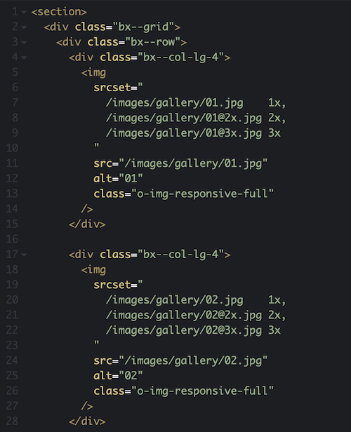

# Reusable HTML patterns

1. [The problem: repetition](#1-the-problem-repetition)
2. [The solution: thinking into patterns](#2-the-solution-thinking-into-patterns)
3. [Conclusions](#3-conclusions)

---

## 1. The problem: repetition

The bigger a code base is, the more likely is to contain patterns, repeated over and over.

### Example 01

Let's imagine an **image gallery** page –created with [Hugo](https://gohugo.io/templates/introduction/)– using responsive images:

👨🏻‍💻 [Example 01 (CodePen)](https://codepen.io/nadalsol/pen/YzpYRYe)

## 2. The solution: thinking into patterns

As you can see, every `` might be a reusable pattern.

### Example 02

- In `"partials/retina-img@3x.html"`: 👨🏻‍💻 [Example 02a (CodePen)](https://codepen.io/nadalsol/pen/PobExQy)
- In `"pages/image-gallery.html"`: 👨🏻‍💻 [Example 02b (CodePen)](https://codepen.io/nadalsol/pen/dyOJQeJ)

## 3. Conclusions

- [DRY](https://cssguidelin.es/#dry)! Repetition makes your front-end code more error prone (the more instances to edit, the worse).
- Don't be greedy: use "patterns/partials/components…". They're free of charge!
- Reusing chunks of code ensures design and code consistency, as well as maintainability and scalability.
- Thinking into components reduce hundreds of lines of code, while makes your code more readable.
